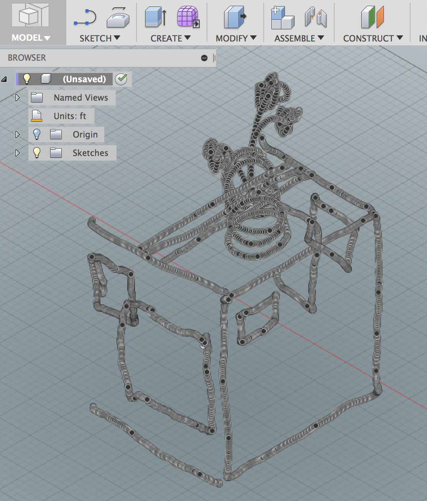

#  Autodesk Fusion 360 ImportCSVPoints

This is an [Autodesk Fusion 360](http://fusion360.autodesk.com/) script that imports a set of points from a CSV file and creates points/lines/splines in a sketch.



The CSV file should contain comma separated coordinate values:

<pre>X,Y[,Z]</pre>

The Z value is optional and will default to 0 if not present.

Additionally, a blank line will indicate a break in a sequence of points.  For example, when the CSV file contains points for multiple lines then each set should be separated by a blank line.  Here is an example of defining the points for two lines:

<pre>
1,1,1
2,2,2
3,3,3

2,8,0
4,6,1
6,4,0
8,2,1
</pre>

When creating only points, not lines or splines, then the blank lines are ignored.

```NOTE: The script does not support UTF-8 encoded files.  For example, Excel supports saving both UTF-8 and non-UTF-8 encoded CSV files.  Choose the non-UTF-8.```

## Installation

Please see the most recent script install instructions here:

https://knowledge.autodesk.com/support/fusion-360/troubleshooting/caas/sfdcarticles/sfdcarticles/How-to-install-an-ADD-IN-and-Script-in-Fusion-360.html 

Download the archive file (ZIP) from Github by clicking on the "Clone or download" button and then selecting "Download ZIP":

Unarchive this file into the Scripts folder and once created, rename the folder created from the Zip archive name "Fusion360ImportCSVPoints-master.zip" to "Fusion360ImportCSVPoints":

You will then be able to use the Fusion 360 Scripts and Addins Manager to add this folder, and thus the script, to Fusion.

## Usage

1. Enter the Model environment
2. Run the "ImportCSVPoints" script from the Script Manager
3. A file dialog will be displayed.
  - Select the comma seperated value (CSV) file containing the points then click OK.
4. The settings dialog will be shown


  - Unit Type: Select the unit of the point values.
  - Style : Select one of the following styles to generate:
    - "Points" : Create a sketch point for each point
    - "Lines" : Create sketch lines connecting the points
    - "Fitted Splines" : Create sketch splines connecting the points
  - Sketch : Select a sketch to use or none to create a new sketch
6. Click OK to generate

## Issues

- The script does not support UTF-8 encoded files.  For example, Excel supports saving both UTF-8 and non-UTF-8 encoded CSV files.  Choose the non-UTF-8.
- A large number of points can take a long time to import.  The sample "sketcher_vr_BoxVaseFlower.csv" takes 35 seconds to import on my 2018 Mac Pro Laptop.

## Fixes

- 2019.07.29 : [@caseymtimm](https://github.com/caseymtimm) pointed out feet -> cm conversion was incorrect.  Submitted fix.
