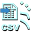
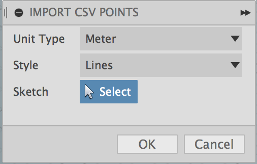

#  Fusion360ImportCSVPoints

This is an [Autodesk Fusion 360](http://fusion360.autodesk.com/) script that imports a set of points from a CSV file and create points/lines/splines in a sketch.

The CSV file should contain comma separated coordinate values:

<pre>X,Y[,Z]</pre>

The Z value is option and will default to 0 if not present.

Additionally, a blank line will indicate a break in a sequence of points.  For example, when the CSV file contains points for multiple lines then each set should be separated by a blank line.  Here is an example of defining the points for two lines:

<pre>
1,1,1
2,2,2
3,3,3

2,8,0
4,6,1
6,4,0
8,2,1
</pre>

When creating only points, not lines or splines, then the blank lines are ignored.

## Installation

Copy this scripts folder into your Fusion 360 "My Scripts" folder. You may find this folder using the following steps:

# Start Fusion 360 and then select the File -> Scripts... menu item
# The Scripts Manager dialog will appear and display the "My Scripts" folder and "Sample Scripts" folders
# Select one of the "My Scripts" files and then click on the "+" Details icon near the bottom of the dialog.
#- If there are no files in the "My Scripts" folder then create a default one.
#- Click the Create button, select JavaScript, and then OK.
# With the user script selected, click the Full Path "..." button to display a file explorer window that will display the "My Scripts" folder
# Copy the files into the folder

For example, on a Mac the folder is located in:
/Users/USERNAME/Library/Application Support/Autodesk/Autodesk Fusion 360/API/Scripts

The script should be ready to run.

## Usage

1. Enter the Model environment
2. Run the "ImportCSVPoints" script from the Script Manager

    

3. A file dialog will be displayed.
  - Select the comma seperated value (CSV) file containing the 3D points then click OK.

4. The settings dialog will be shown

  

  - Unit Type: Select the unit of the point values.
  - Style : Select one of the following styles to generate:
    - "Sketch Points" : Create a sketch point for each point
    - "Sketch Lines" : Create sketch lines connecting the points
    - "Splines" : Create sketch splines connecting the points
  - Sketch : Select a sketch to use or none to create a new sketch
6. Click OK to generate

## Issues

- None
