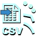
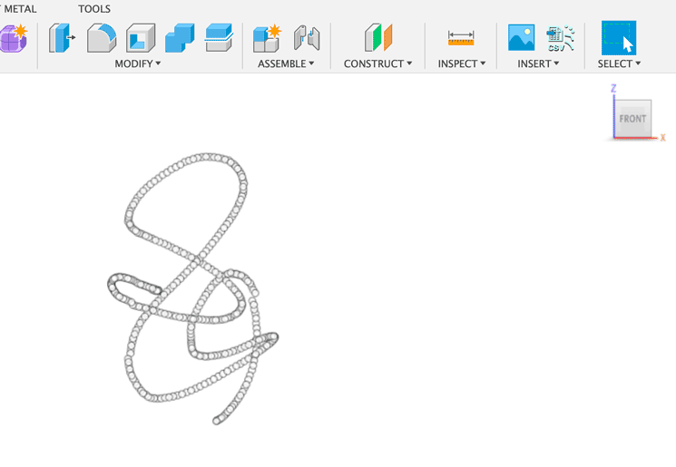
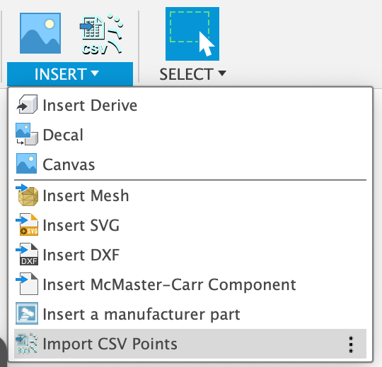
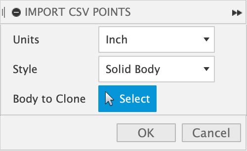
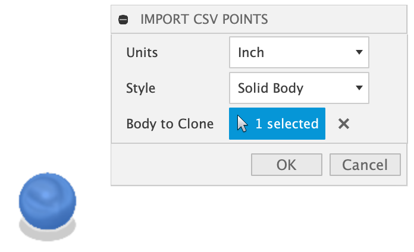
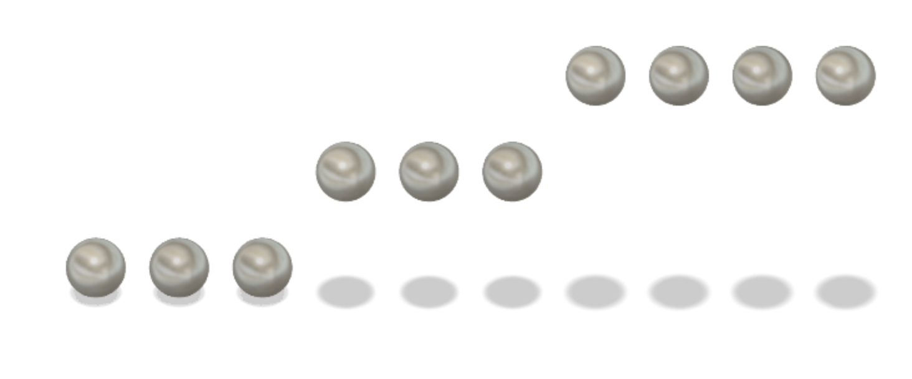
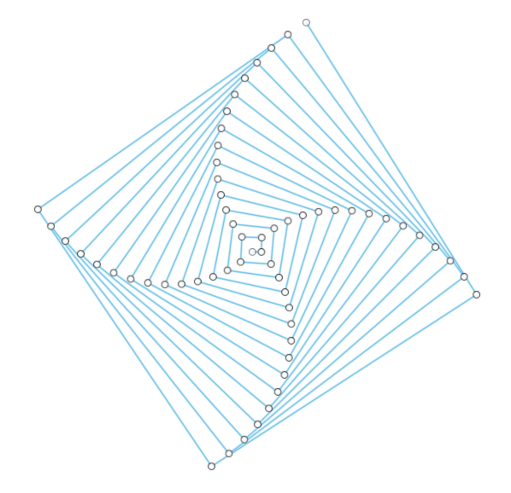
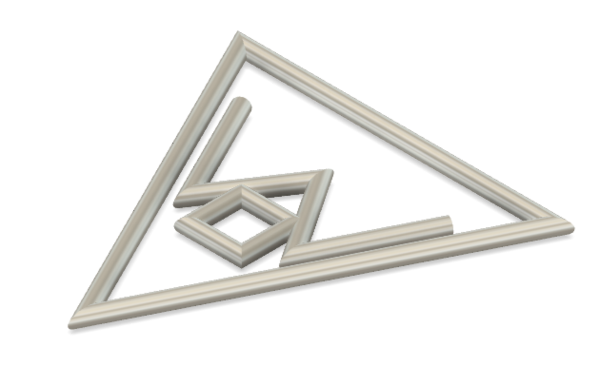

#  Import CSV Points for Autodesk Fusion 360

This is an [Autodesk Fusion 360](http://fusion360.autodesk.com/) add-in that imports a set of points from a CSV file and creates points/lines/splines in a sketch.


The CSV file should contain comma separated coordinate values:

<pre>X,Y[,Z]</pre>

> The Z value is optional and will default to 0 if not present.  Note that importing of 2D points is required if selecting a sketch or construction plane that is not on the XY plane.  Otherwise, when 3D points are imported they are placed in modal space rather than relative to the sketch plane.

Additionally, a blank line will indicate a break in a sequence of points.  For example, when the CSV file contains points for multiple lines then each set should be separated by a blank line.  Here is an example of defining the points for two lines:

<pre>
1,1,1
2,2,2
3,3,3

2,8,0
4,6,1
6,4,0
8,2,1
</pre>

The blank lines will only be recognized when creating lines or splines.  Otherwise they will be ignored.

```NOTE: The script does not support UTF-8 encoded files.  For example, Excel supports saving both UTF-8 and non-UTF-8 encoded CSV files.  Choose the non-UTF-8.```

Here's the sketcher_vr_Simple.csv example:



## Installation

Please see the most recent install instructions here:

https://knowledge.autodesk.com/support/fusion-360/troubleshooting/caas/sfdcarticles/sfdcarticles/How-to-install-an-ADD-IN-and-Script-in-Fusion-360.html 

If you are installing manually, then please download the archive file (ZIP) from Github by clicking on the "Clone or download" button and then selecting "Download ZIP".

Once you have the ZIP file, please follow the manual install instructions in the link above.

Note, installing the add-in into the Fusion 360 Addins folder allows it to automatically be found and displayed in the add-ins list.

### Mac Add-Ins Folder

```
"$HOME/Library/Application Support/Autodesk/Autodesk Fusion 360/API/AddIns/"
```

### Windows Add-Ins Folder

```
"C:\Users\%YOUR_USER_NAME%\AppData\Roaming\Autodesk\Autodesk Fusion 360\API\AddIns"
```

### Manual Install

1. With your Finder or File Explorer window, locate the AddIns folder.
1. Create a folder within the AddIns folder with the same name as the add-in.  In this case, "ImportCSVPoints".
1. Extract all of the add-in files from the (ZIP) archive and place them in this folder.
1. Now the add-in is ready for Fusion 360.  Start Fusion 360.
1. Display the Scripts and Add-Ins dialog.  The "ImportCSVPoints" add-in should be listed.
1. See the *Usage* section below for running and using.

> As an alternative to the above installation location, you can just place the files in their own folder within a location of your choice.  For example, in your Documents or Home folder.  Doing this means the add-in will *not* automatically appear in the add-ins list.  You will need to manually add it using the "+" button at the top of the list.

## Usage

1. Enter the Model environment
1. Run the "Import CSV Points" add-in from the Insert dropdown

    

1. The settings dialog will be shown

    

    - Units : Select the units of the CSV point values.
    - Style : Select one of the following styles to generate:
        * __Points__ : Create a sketch point for each point
        * __Lines__ : Create sketch lines connecting the points
        * __Fitted Splines__ : Create sketch splines connecting the points
        * __Solid Body__ : Experimental feature (see section below for information)
    - Sketch : Select a sketch to use or none. If no sketch is selected then a new sketch will be created on the construction plane selected (see below).
    - Construction Plane:
        * Enabled when no sketch or profile is selected.  Select which construction plane for the new sketch created.

1. Click OK
1. A file dialog will be displayed.
  - Select the comma seperated value (CSV) file containing the points then click OK.

## Experimental Features

### Solid Body Style

The "Solid Body" Style is an experimental feature and isn't guaranteed to work.



When this style is selected, the dialog changes to allow selection of a single solid body.  The selected solid body will be cloned for each point loaded from the CSV file.  The locations loaded from the CSV file will be *relative* to the selected solid body.  For example, a location of 0,0,0 will be at the same location of the selected body.  A location of 5,5,0 will be offset 5 units in the XY direction.

Here's selecting a sphere solid body.



And the result of selecting the sphere and then the 'simple3D.csv' file.



### Patterns

A CSV file may contain a "pattern" command on a line rather than a set of coordinates.  See the sample files:

* spiral.csv
* spiralcube.csv

If a CSV file contains a pattern command along with valid argument values, then a set of points will be generated and imported.  For example, selecting the "Line" style and then the spiralcube.csv sample file will generate the following sketch.



### Pipes

This is a little bit of a hack at the moment.  But it's possible now to create pipes for lines/splines.  To use this feature, include the "pipes" command in the CSV file.

Usage 'Hollow' pipe:

<pre>pipes, OuterRadius, InnerRadius</pre>

Usage 'Solid' pipe:

<pre>pipes, OuterRadius</pre>

Arguments:

    - OuterRadius : Specifies the outer radius of the pipe
    - InnerRadius : (Optional) Specifies inner (hollow) radius or set to 0 or leave empty for a solid pipe

See or try the sample CSV files whose filenames end with "_pipes.csv" for examples.




### Circles

Drawing circles in 2D/3D

<pre>circle,x,y,radius</pre>
<pre>circle,x,y,z,radius</pre>

## Issues

- The script does not support UTF-8 encoded files.  For example, Excel supports saving both UTF-8 and non-UTF-8 encoded CSV files.  Choose the non-UTF-8.
- A large number of points can take a long time to import.  The sample "sketcher_vr_BoxVaseFlower.csv" takes 35 seconds to import on my 2018 Mac Pro Laptop.
- The OK button of the dialog will sometimes be disabled even though the settings are valid.  The workaround is to force an update by selected a different construction plane or style then reselecting the original value.

## Credits

- 2019.07.29 : [@caseymtimm](https://github.com/caseymtimm) pointed out feet -> cm conversion was incorrect.  Submitted fix.
- 2021.04.22 : [@HaikVasil](https://github.com/HaikVasil) provided fix for creating connecting lines. Also the suggestion to add Pipes support.
